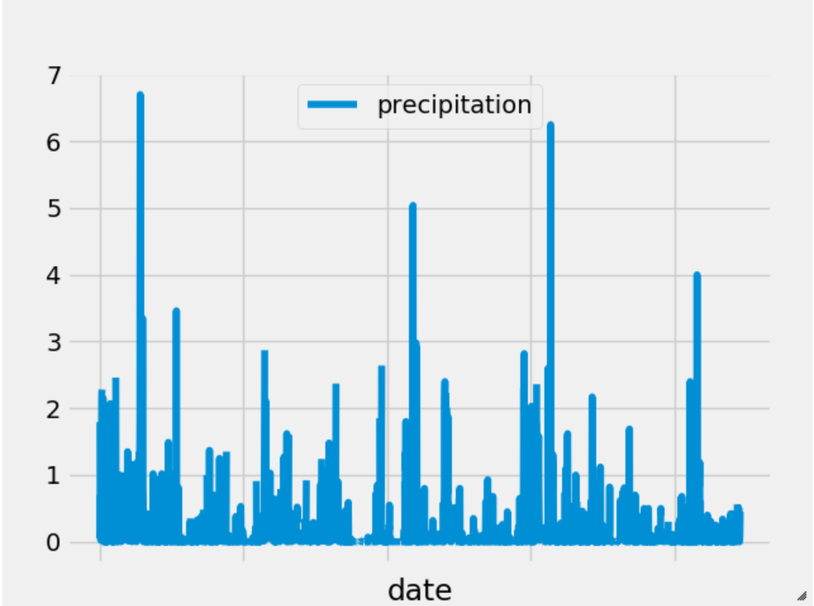

## Climate Analysis and Exploration

Python and SQLAlchemy used to do basic climate analysis and data exploration of climate database. All of the following analysis should be completed using SQLAlchemy ORM queries, Pandas, and Matplotlib.

* Use [starter notebook](climate_starter.ipynb) and [hawaii.sqlite](Resources/hawaii.sqlite) files to complete climate analysis and data exploration.

* 1 year time frame Start date: August 23, 2016 to End Date: Auguest 23, 2017.

* SQLAlchemy `create_engine` used to connect to your sqlite database.

* SQLAlchemy `automap_base()` used to reflect tables into classes and save reference to classes called `Station` and `Measurement`.

### Precipitation Analysis

* Query to retrieve the last 12 months of precipitation data.

* Select only `date` and `prcp` values.

* Load query results into a Pandas DataFrame and set index to the date column.

* Sort the DataFrame values by `date`.

* Plot the results using the DataFrame `plot` method.

  

* Pandas used to print the summary statistics for the precipitation data.

### Station Analysis

* Design query to calculate the total number of stations.

* Design query to find the most active stations.

  * List stations and observation counts in descending order.

  * Station with the highest number of observations: USC00519281 WAIHEE 837.5, HI US with 2772 counts

* Design query to retrieve the last 12 months of temperature observation data (tobs).

  * Filter by station with the highest number of observations.

  * Plot the results as a histogram with `bins=12`.

    

- - -

## Climate App

Now that you have completed your initial analysis, design a Flask API based on the queries that you have just developed.

* Use FLASK to create your routes.

### Routes

* `/`

  * Home page.

  * List all routes that are available.

* `/api/v1.0/precipitation`

  * Convert query results to a Dictionary using `date` as the key and `prcp` as the value.

  * Return JSON representation of your dictionary.

* `/api/v1.0/stations`

  * Return JSON list of stations from the dataset.

* `/api/v1.0/tobs`
  * query for dates and temperature observations from a year from the last data point.
  * Return a JSON list of Temperature Observations (tobs) for the previous year.

* `/api/v1.0/<start>` and `/api/v1.0/<start>/<end>`

  * Return a JSON list of the minimum temperature, the average temperature, and the max temperature for a given start or start-end range.

  * When given the start only, calculate `TMIN`, `TAVG`, and `TMAX` for all dates greater than and equal to the start date.

  * When given the start and the end date, calculate the `TMIN`, `TAVG`, and `TMAX` for dates between the start and end date inclusive.

### Temperature Analysis

* The starter notebook contains a function called `calc_temps` that will accept a start date and end date in the format `%Y-%m-%d` and return the minimum, average, and maximum temperatures for that range of dates.

* Use the `calc_temps` function to calculate the min, avg, and max temperatures for your trip using the matching dates from the previous year (i.e., use "2017-01-01" if your trip start date was "2018-01-01").

* Plot the min, avg, and max temperature from previous query as a bar chart.

  * Use the average temperature as the bar height.

  * Use the peak-to-peak (tmax-tmin) value as the y error bar (yerr).

    

### Daily Rainfall Average.

* Calculate the rainfall per weather station using the previous year's matching dates.

* Calculate the daily normals. Normals are the averages for the min, avg, and max temperatures.

* Function - `daily_normals` calculates the daily normals for a specific date. This date string will be in the format `%m-%d`.

* Create a list of dates for trip in the format `%m-%d`. Using the `daily_normals` function to calculate the normals for each date string and append the results to a list.

* Load the list of daily normals into a Pandas DataFrame and set the index equal to the date.

* Pandas used to plot an area plot (`stacked=False`) for the daily normals.

  
